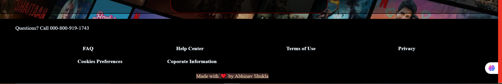

=======
# 🎬 Netflix-Inspired Login Page  

A simple **Netflix login page clone** built using **React** with responsive design and hover effects. This project replicates the Netflix login UI while ensuring a smooth experience across different screen sizes.  

## 📸 Screenshot  

## 🚀 Features  
- 🎨 **Netflix-like UI** with the same font and design.  
- 📱 **Fully responsive** – Works on mobile, tablet, and desktop.  
- 🖱️ **Hover effects** on buttons for a better user experience.   

## 🛠️ Tech Stack  
- **Frontend:** React, JavaScript, HTML, CSS  
- **Styling:** Flexbox, Media Queries  
